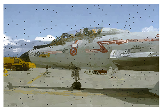
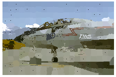
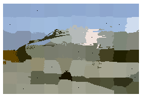

# SLIC-Superpixels
Image Segmentation is the process of partitioning an image into multiple segments(superpixels). The goal is to represent the image as something that is easier to analyze. In other words, image segmentation is the process of assigning a label to every pixel in an image such that pixels with the same label share certain characteristics.

## Overview

Superpixel algorithms group pixels into perceptually meaningful regions while respecting potential object contours, and thereby can replace the rigid pixel grid structure. Due to the reduced complexity, superpixels are becoming popular for various computer vision applications, e.g., multiclass object segmentation, depth estimation, human pose estimation, and object localization.

In this problem, you will implement a simple superpixel algorithm called Simple Linear Iterative Clustering (SLIC) that clusters pixels in the five-dimensional color and pixel coordinate space (e.g., r, g, b, x, y). The algorithm starts with a collection of K cluster centers initialized at an equally sampled regular grid on the image of N pixels. For each cluster, you define for a localized window 2S x 2S centered at the cluster center, where S = sqrt(N/K) is the roughly the space between the seed cluster centers. Then, you check whether the pixel within the 2S x 2S local window should be assigned to the cluster center or not (by comparing the distance in 5D space to the cluster center). Once you loop through all the clusters, you can update the cluster center by averaging over the cluster members. Iterate the pixel-to-cluster assignment process till convergence or maximum iterations reached.

Reference Paper: http://www.kev-smith.com/papers/SMITH_TPAMI12.pdf

# Results


<br>
Parameters: K = 1024, m = 2
<br>

<br>
Parameters: K = 1024, m = 10
<br>

<br>
Parameters: K = 1024, m = 40

# Usage

```
Run the SLIC_Superpixels.ipynb file in Jupyter Notebook / Google Colab
```

# Folder Structure

```
📦SLIC-Superpixels
 ┣ 📂results
 ┃ ┣ 📜k1024m10.png
 ┃ ┣ 📜k1024m2.png
 ┃ ┗ 📜k1024m40.png
 ┣ 📜.gitignore
 ┣ 📜LICENSE
 ┣ 📜README.md
 ┗ 📜SLIC_Superpixels.ipynb
```